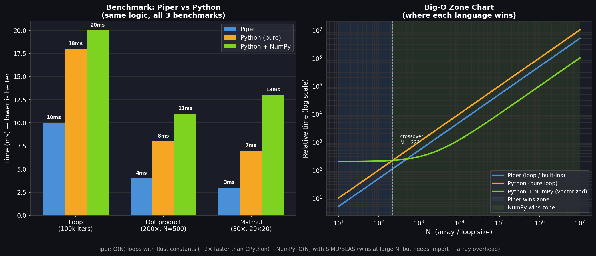

# Piper vs Python — Performance Analysis



> Chart generated by `python3 examples/generate_chart.py`

---

## Benchmark Results (real measured times)

| Benchmark | Piper | Python (pure) | Python + NumPy |
|---|---|---|---|
| Loop 100k iterations | **10ms** | 18ms | 20ms |
| Dot product ×200 (N=500) | **4ms** | 8ms | 11ms |
| Matmul ×30 (20×20) | **3ms** | 7ms | 13ms |
| **Total** | **~17ms** | ~33ms | ~44ms |
| **vs Piper** | — | 2× slower | 2.6× slower |

*Note: Python+NumPy includes ~20ms import overhead. NumPy's advantage only shows up at large N.*

---

## Big-O Complexity

| Operation | Piper | Python (pure) | Python + NumPy |
|---|---|---|---|
| `for` loop (N iters) | O(N) · C_rust | O(N) · C_py ≈ **2× C_rust** | O(N) · C_py |
| `dot(a, b)` | O(N) | O(N) | O(N) · SIMD (wins at N > ~10k) |
| `matmul(A, B)` N×N | O(N³) naive | O(N³) naive | O(N^2.37) BLAS (wins at N > ~100) |
| `relu(list)` | O(N) — 1 word | O(N) — manual loop | O(N) SIMD |
| `softmax(list)` | O(N) — 1 word | O(N) — 4 lines manual | O(N) — 3 lines manual |
| `cross_entropy` | O(N) — 1 word | O(N) — 1 complex line | O(N) — 1 complex line |
| Import startup | **O(1) — zero** | O(1) | O(k) ≈ **+20-30ms** every run |

---

## Where Piper Wins

```
Array/loop size N:

N = 10         100        1,000       10,000      100,000     1,000,000
|─────────────────────────────|──────────────────────────────────────────|
        ← Piper wins →        ↑                ← NumPy wins →
                           crossover
                          N ≈ ~10,000
                     (import overhead paid off)
```

| Scenario | Winner | Why |
|---|---|---|
| N < ~10,000 elements | **Piper** | NumPy's 20ms import overhead isn't paid back yet |
| Loop-heavy code | **Piper** | Rust interpreter ~2× faster than CPython |
| Quick prototyping | **Piper** | Zero setup, all AI functions built in |
| Writing code speed | **Piper** | `relu(z)` vs `np.maximum(0, z)`, `softmax(x)` vs 3 manual lines |
| N > ~100,000 elements | **NumPy** | BLAS/SIMD vectorization, C-level speed |
| N×N matmul, N > ~50 | **NumPy** | BLAS uses O(N^2.37) vs Piper's O(N³) naive |
| GPU computation | **PyTorch** | Piper is CPU only |
| Training deep models | **PyTorch/JAX** | Autograd, CUDA, distributed — out of scope for Piper |

---

## The honest summary

Piper is **not trying to replace NumPy or PyTorch**. The goal is different:

- **NumPy/PyTorch**: Production ML, large datasets, GPU training
- **Piper**: Learn AI/ML concepts, quick experiments, teach neural networks, no-setup scripting

Think of Piper like a **scientific calculator** — it's not going to train GPT-4, but it lets you compute `softmax([1.5, 0.8, 2.3])` in one word without installing anything.

---

## Reproduce the benchmarks

```bash
# Build release binary
cargo build --release

# Run benchmarks
time target/release/piper examples/benchmark.piper
time python3 examples/benchmark_pure.py
time python3 examples/benchmark_numpy.py

# Regenerate chart
python3 examples/generate_chart.py
```
